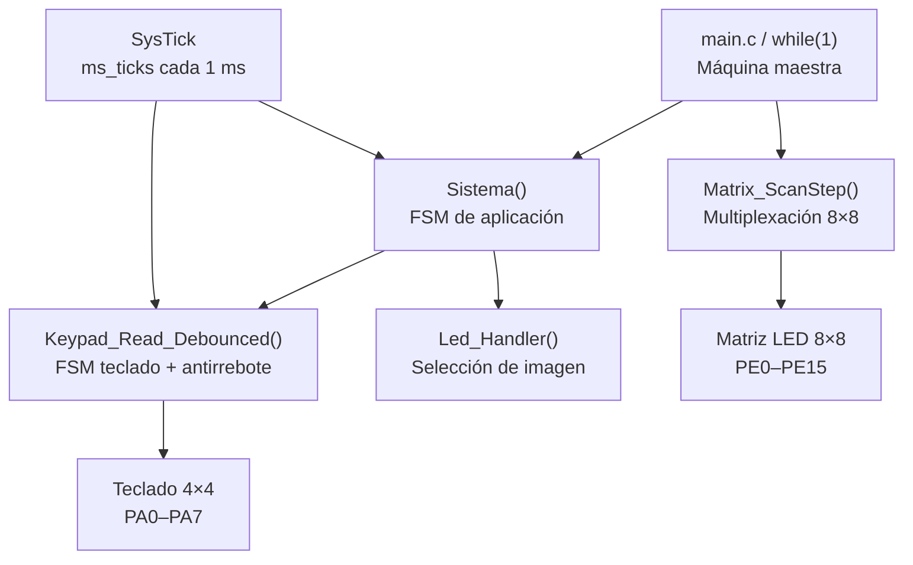

# Reto 2 — Sistema de Acceso con Teclado Matricial y Matriz LED 8×8

Implementación **Bare-Metal** para el microcontrolador **STM32F407VET6** de un sistema de acceso mediante contraseña de 4 caracteres.

El proyecto integra:

- Teclado matricial 4×4 mediante multiplexación **IN-OUT**.
- Máquina de estados para **antirrebote**.
- Matriz LED 8×8 mediante multiplexación **OUT-OUT**.
- Máquina de estados para ingreso y validación de contraseña.
- Base de tiempo mediante **SysTick**.
- Arquitectura cooperativa y no bloqueante.
- Acceso directo a registros, sin HAL ni LL.

## Funcionamiento

Al iniciar, el sistema muestra una imagen de espera en la matriz LED. Cada pulsación válida del teclado es procesada una sola vez mediante la máquina de estados de antirrebote.

Después de ingresar cuatro caracteres:

- Si la contraseña es correcta, se muestra una figura de **acceso permitido**.
- Si la contraseña es incorrecta, se muestra una **X**.
- El resultado permanece aproximadamente 3 segundos y después el sistema regresa al estado de espera.

La contraseña inicial definida en el programa es:

```text
ABCD
```

También se implementó una función adicional: al ingresar `****`, el sistema permite registrar una nueva contraseña de cuatro caracteres.

## Estructura del repositorio

```text
Reto_2_Sistema_Acceso_STM32F407/
│
├── Core/
│   ├── Inc/
│   │   ├── keypad.h
│   │   ├── led_matrix.h
│   │   ├── sistema.h
│   │   └── timebase.h
│   │
│   └── Src/
│       ├── keypad.c
│       ├── led_matrix.c
│       ├── main.c
│       ├── sistema.c
│       └── timebase.c
│
├── docs/
│   ├── arquitectura.md
│   ├── conexiones.md
│   ├── diagramas_estados.md
│   ├── explicacion_codigo.md
│   └── pruebas.md
│
├── .gitignore
└── README.md
```

## Arquitectura general



El `while(1)` llama continuamente a `Sistema()` y `Matrix_ScanStep()`. De esta forma, la lógica de contraseña y la actualización de la matriz pueden avanzar de manera cooperativa sin utilizar retardos de segundos que bloqueen el microcontrolador.

## Módulos

### `keypad`

Configura:

- `PA0–PA3`: filas del teclado como salidas.
- `PA4–PA7`: columnas como entradas con resistencias pull-up.

Realiza el barrido del teclado y utiliza una FSM de cuatro estados para validar una única pulsación.

### `led_matrix`

Configura `PE0–PE15` como salidas:

- `PE0–PE7`: columnas.
- `PE8–PE15`: filas.

La función `Matrix_ScanStep()` activa una fila por iteración y carga el patrón correspondiente en las columnas.

### `timebase`

Configura SysTick para producir una interrupción cada 1 ms. La variable global `ms_ticks` permite implementar temporizaciones sin utilizar `HAL_Delay()`.

### `sistema`

Contiene la máquina de estados principal:

```text
ESPERANDO
   ↓
INGRESANDO
   ↓
VALIDANDO
  ↙   ↘
ACCESO  DENEGADO
   \     /
    3 segundos
        ↓
    ESPERANDO
```

También incorpora el estado `CONTRASENIA_DINAMICA` para cambiar la contraseña al ingresar `****`.

## Tabla rápida de conexiones

| Dispositivo | Señales | GPIO |
|---|---|---|
| Teclado 4×4 | F0–F3 | PA0–PA3 |
| Teclado 4×4 | C0–C3 | PA4–PA7 |
| Matriz LED 8×8 | C0–C7 | PE0–PE7 |
| Matriz LED 8×8 | F0–F7 | PE8–PE15 |

La correspondencia física utilizada para la matriz 1088AS se encuentra en [`docs/conexiones.md`](docs/conexiones.md).

## Documentación

- [Arquitectura del sistema](docs/arquitectura.md)
- [Diagramas de estados](docs/diagramas_estados.md)
- [Tabla de conexiones](docs/conexiones.md)
- [Explicación del código](docs/explicacion_codigo.md)
- [Pruebas de funcionamiento](docs/pruebas.md)

## Requisitos

- STM32F407VET6.
- CMSIS / archivo de dispositivo `stm32f4xx.h`.
- Teclado matricial 4×4.
- Matriz LED 8×8 compatible con la polaridad configurada.
- Proyecto de STM32CubeIDE o entorno equivalente con archivos de startup y linker para el STM32F407VET6.

> La lógica del reto está implementada directamente mediante registros. No se emplean HAL ni LL para las funciones solicitadas.
