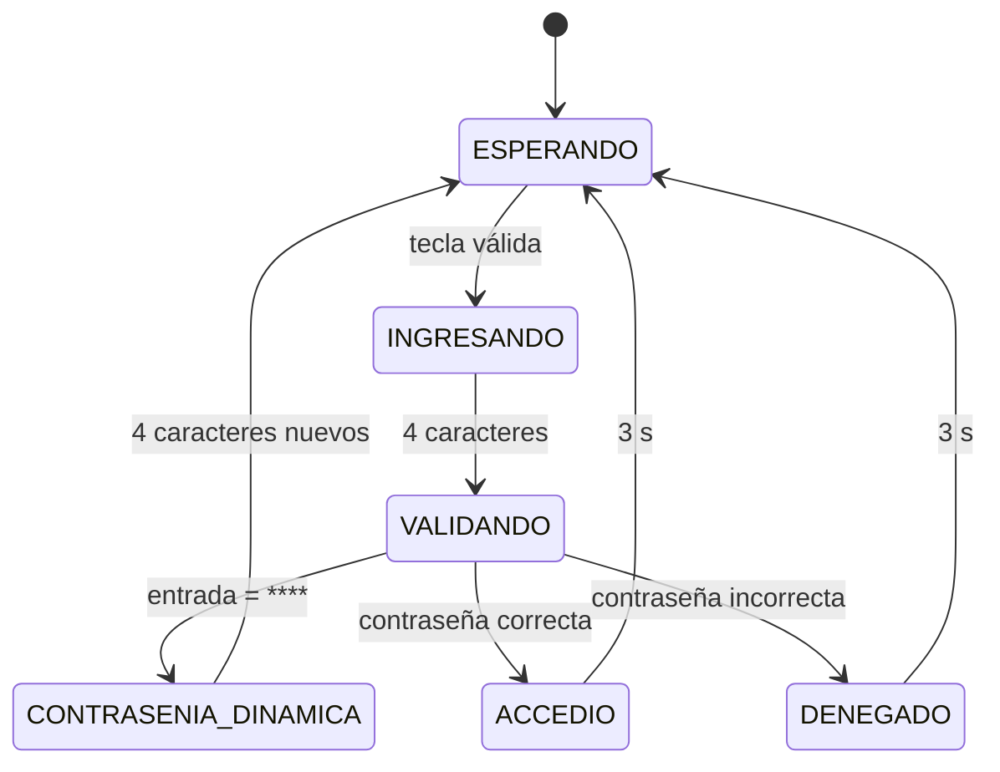
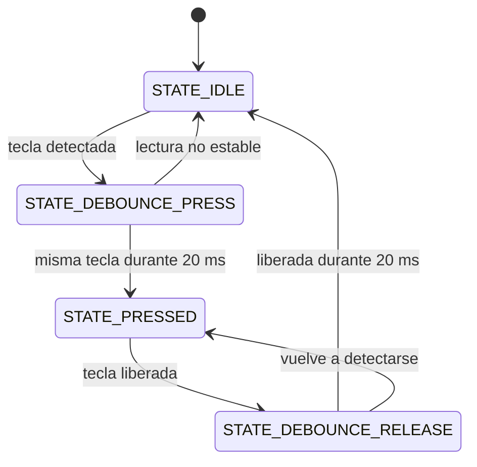
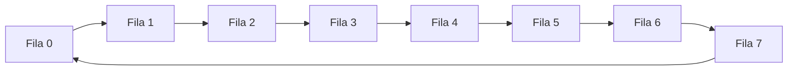

# Diagramas de estados

## 1. Máquina de estados del sistema

### Estados

- `ESPERANDO`: espera la primera tecla.
- `INGRESANDO`: almacena hasta completar cuatro caracteres.
- `VALIDANDO`: compara los cuatro caracteres ingresados.
- `ACCEDIO`: muestra la figura de acceso.
- `DENEGADO`: muestra una X.
- `CONTRASENIA_DINAMICA`: recibe una nueva contraseña después de ingresar `****`.

## 2. Máquina de estados del antirrebote

La tecla se entrega a la aplicación únicamente en la transición hacia `STATE_PRESSED`. Por esto una tecla mantenida no genera múltiples eventos.

## 3. Multiplexación de la matriz

`Matrix_ScanStep()` avanza una sola fila por llamada. El recorrido se repite continuamente desde `main.c`.
